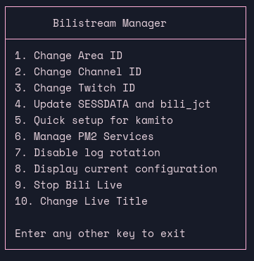

This project is inspired by [limitcool/bilistream](https://github.com/limitcool/bilistream) but has been significantly redesigned and enhanced using [Cursor](https://www.cursor.com/). While it shares the same core concept, this implementation offers distinct features and improvements.


# bilistream

bilistream is an automated tool for rebroadcasting Twitch and YouTube streams to Bilibili Live without requiring constant supervision. It's perfect for content creators who want to expand their audience across multiple platforms effortlessly.

## Dependecies
- ffmpeg
- yt-dlp
- streamlink (with a plugin installed [2bc4/streamlink-ttvlol](https://github.com/2bc4/streamlink-ttvlol))
- pm2 ()

## Build
For debian 12
```bash
cargo zigbuild --target x86_64-unknown-linux-gnu.2.36 --release
```
## Usage
```bash
bilistream [OPTIONS]

OPTIONS:
    -c, --config <CONFIG>    [default: ./config.yaml]
    -h, --help               Print help information
    -V, --version            Print version information
```

`config.yaml` Template


``` yaml
# 检测直播间隔
Interval: 60
# 需要转播的平台 Twitch || Youtube 
Platform: Youtube
# B站推流账号Cookie
BiliLive:
  Title: "直播间标题"
  # 分区
  Area_v2: 分区ID # https://api.live.bilibili.com/room/v1/Area/getList
  SESSDATA: # in Cookie 
  bili_jct: # in Cookie
  DedeUserID: 账号UID # in Cookie
  DedeUserID__ckMd5: # in Cookie
  Room: 直播间号
  BiliRtmpUrl: rtmp://live-push.bilivideo.com/live-bvc/qq
  # BiliRtmpUrl: B站开播设置页面的服务器地址
  BiliRtmpKey: "?streamname=live_UID_xxxxxxxx&key=xxxxxxxxxxxxxxxxxxxxx=rtmp&pflag=1"
  # BiliRtmpKey: B站开播设置页面的串流密钥,需注意,由于是?号开头的,本行需要对内容加双引号

Twitch:
  ChannelName: "Name of streamer" # Custom
  ChannelID: # the string followed after https://www.twitch.tv/  
  AuthToken: # check https://streamlink.github.io/cli/plugins/twitch.html#authentication

Youtube:
  ChannelName: "Name of streamer" # Custom
  ChannelId: # Youtube Channel ID
# FfmpegProxy: 
# Ffmpeg代理地址,无需代理可以不填此项或者留空
```

## Use of stream_manager.sh

```bash
#cd to where you put bilistream (bin) and stream_manager.sh

mkdir YT
mkdir TW
# follow the template to config
vim ./YT/config.yaml # with Platform: Youtube
vim ./TW/config.yaml # with Platform: Twitch
# with tree .
.
├── bili_change_live_title
├── bili_stop_live
├── bilistream
├── stream_manager.sh
├── TW
│   └── config.yaml
└── YT
    └── config.yaml

# install pm2 to manage and monit

./stream_manager.sh
```
### Bilistream manager main menu
