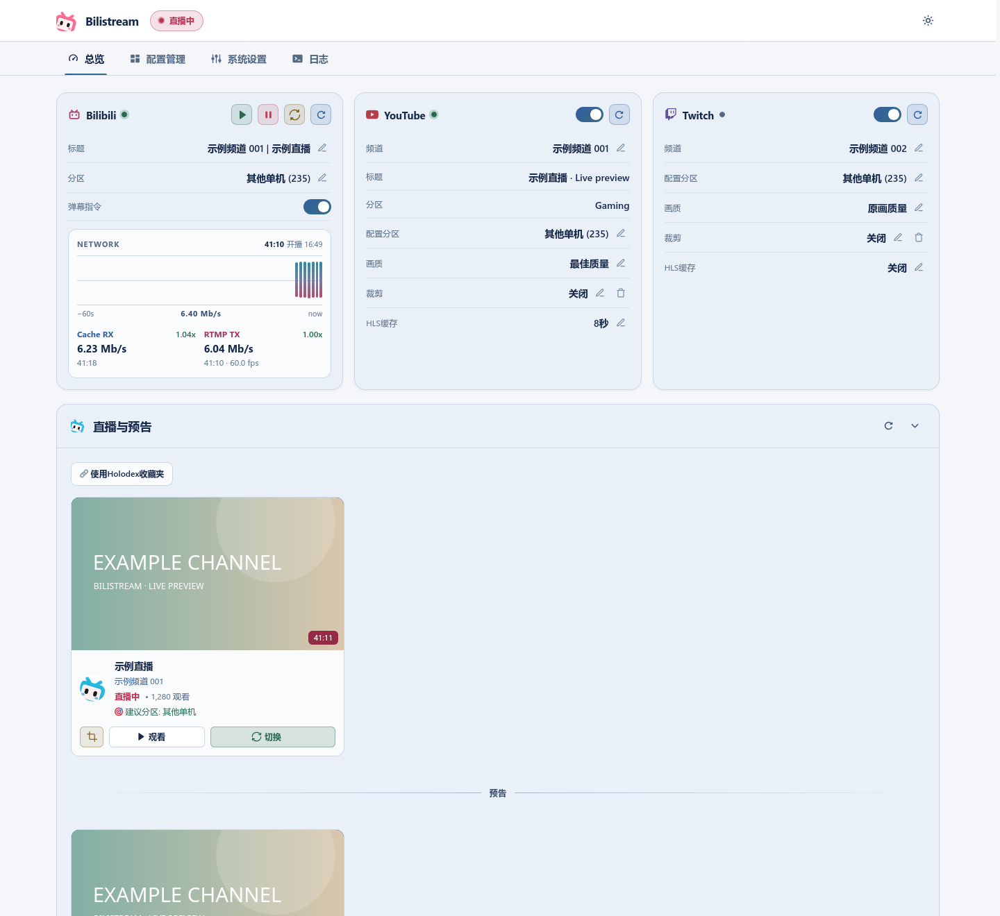

<div align="center">

<h1> Bilistream</h1>

[English](README.md) | [中文](README.zh_CN.md)

</div>

Rebroadcast YouTube and Twitch to Bilibili Live, with a browser control panel and an optional Tauri desktop shell.

## Quick start

1. Download a build from [GitHub Releases](https://github.com/Detteee/bilistream/releases). This README describes the current source; published releases may contain an earlier feature set.
2. On Windows, run `bilistream.exe`. On Linux/macOS, run `./bilistream` and open `http://localhost:3150`.
3. Complete the browser setup wizard: Bilibili QR login, room settings, your own channels and official area selection. Paste a YouTube channel URL or @handle, or optionally import selected Holodex favourites using your API key and JWT.
4. Choose a restream target for each platform you want to monitor; **不转播** leaves that platform off. You can import channels and start monitoring later. The default setup runs on a single server.

New installations start with an empty channel roster and a minimal area template (其他单机). The wizard saves your selections and preserves existing files. UI assets are bundled; Windows ffmpeg/yt-dlp dependencies download when needed.

## Control panel



- **Source monitors:** YouTube and Twitch; configure title, area, quality, crop and HLS cache by platform.
- **Live & upcoming list:** configure a Holodex API key to browse streams, switch targets and see suggested areas. Optional Holodex login adds favourites.
- **Stream controls:** Bilibili start/stop, rebroadcast restart, live bitrate/cache meters, title/area/cover updates, danmaku commands, keyword filters, LoL player-name checks and collision avoidance.

Setup and area management offer the official area picker, filling IDs and names automatically. [First-run guide](docs/first-run.md).

## Advanced settings

For priority channels, RSS, WebSub, YouTube Data API, public status, multi-server mode and Niconico, see [Advanced settings](docs/advanced-settings.md).

## Dependencies and build

- **ffmpeg** and **yt-dlp**: Windows installs the binaries automatically; install them yourself on Linux/macOS.
- **streamlink**: needed for Twitch and Niconico. For Twitch, install the [streamlink-ttvlol plugin](https://github.com/2bc4/streamlink-ttvlol).
- Some sources need cookies. Configure YouTube cookies and the Niconico user_session value in the Web UI; Bilibili login is handled by the wizard.

Build the current source with a Rust toolchain:

```bash
git clone https://github.com/Detteee/bilistream.git
cd bilistream
cargo build --release --bin bilistream
./target/release/bilistream
```

The optional desktop package is `src-tauri` (`bilistream-tauri`); it shares the Rust backend and needs the [Tauri platform prerequisites](https://v2.tauri.app/start/prerequisites/). Linux cross-builds can use `cargo zigbuild --target x86_64-unknown-linux-gnu.2.36 --release` with cargo-zigbuild and Zig installed.

## Launch and configuration

```bash
./bilistream --webui
./bilistream --tray
./bilistream --port 3150
./bilistream --bind 127.0.0.1
./bilistream --password '<password>'
./bilistream --ffmpeg-log-level error
```

Bind, port and password can also come from `BILISTREAM_BIND`, `BILISTREAM_PORT` and `BILISTREAM_PASSWORD`. By default the admin listener binds localhost. Put remote access behind your configured authenticated endpoint.

Runtime files live **beside the running executable**, not necessarily in the repository root:

| File | Contents |
| --- | --- |
| `config.json` | Settings; prefer editing through the Web UI. [Commented example](config.json.example) is a reference, not strict JSON. |
| `cookies.json` | Bilibili login credentials; keep private. |
| `channels.json` / `areas.json` | Channel roster and area/keyword rules. |
| `invalid_words.txt` | Optional LoL player-name filter, one word per line. |
| `youtube_quota.json` / `youtube_golive_hours.json` | Generated API usage and learned discovery timing. |
| `webui/dist/` / `webui/public-dist/` | Installed admin and public page assets. |

The default priority monitor and multi-server mode are off. Display preferences do not change monitor state. Existing configuration keys remain compatible.

Danmaku target changes use channel names from `channels.json`, for example:

```text
%转播%YT%示例频道1%英雄联盟
%转播%TW%示例频道1%无畏契约
%查询
```

Area keyword rules may adjust the requested area. LoL checking requires a Riot key; `lol_monitor_interval` is in minutes.

## License and acknowledgements

[Unlicense](LICENSE). Based on [limitcool/bilistream](https://github.com/limitcool/bilistream), with danmaku support informed by [Isoheptane/bilibili-live-danmaku-cli](https://github.com/Isoheptane/bilibili-live-danmaku-cli). Contributions through issues and pull requests are welcome.
