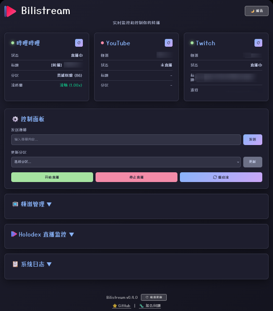

<div align="center">

<h1>
  
  Bilistream
</h1>

[English](README.md) | [中文](README.zh_CN.md)

</div>

## 下载

**最新版本：v0.4.2**

从 [GitHub Releases](https://github.com/Detteee/bilistream/releases) 下载最新版本

**快速开始：**

1. **Windows:** 双击 `bilistream.exe` - 后台运行，浏览器自动打开webui！
2. **Linux/Mac:** 终端运行 `./bilistream`
3. **自动下载:** 首次运行时自动下载必需文件：
   - `webui/dist/index.html` - Web 界面
   - `areas.json` - B站分区和禁用关键词
   - `channels.json` - 预设频道列表
   - **仅 Windows:** `yt-dlp.exe` 和 `ffmpeg.exe`
4. 在浏览器中打开 `http://localhost:3150`
5. **首次运行:** 在浏览器中完成设置向导（二维码登录、配置）
6. **后续运行:** 直接访问控制面板

## 功能特点

- **自动更新** - 从 Web UI 一键更新
  - 启动时自动检测更新
  - 安全安装并备份
  - 保留所有配置和用户数据
  - 更新后自动重启
- **Web UI** - 现代化控制面板，用于监控和管理直播
- **网页版设置向导** - 通过浏览器完成首次配置（无需命令行！）
  - 浏览器中显示二维码登录
  - 分步引导式设置
  - 实时状态更新
- **自动转播** - Twitch 和 YouTube 直播到哔哩哔哩
- **预定直播** - 支持 YouTube 预定直播
- **自动设置** - 自动更新哔哩哔哩直播标题、分区和封面
- **弹幕命令** - 离线时通过聊天更改监控目标
- **英雄联盟监控** - 玩家名称发现黑名单词汇时停止直播
- **防撞车** - 避免转播已被转播的内容

## Web UI 预览



## 依赖

**Windows:**

- ✨ **自动下载！** 核心依赖项会在首次运行时自动下载：
  - ffmpeg.exe
  - yt-dlp.exe
- **Twitch 支持**（可选）：
  - 安装 streamlink: [下载](https://github.com/streamlink/windows-builds/releases) 或 `pip install streamlink`
  - 安装 ttvlol 插件: [streamlink-ttvlol](https://github.com/2bc4/streamlink-ttvlol)

**Linux/Mac:**

- ffmpeg
- yt-dlp
- streamlink (需安装 [2bc4/streamlink-ttvlol](https://github.com/2bc4/streamlink-ttvlol) 插件)

## 安装步骤

1. 克隆仓库：

   ```bash
   git clone https://github.com/your-username/bilistream.git
   cd bilistream
   ```
2. 安装所需依赖（以 Debian 系统为例）：

   ```bash
   sudo apt update
   sudo apt install ffmpeg python3-pip
   pip install yt-dlp streamlink
   ```
3. 安装 streamlink-ttvlol 插件：
   按照 [2bc4/streamlink-ttvlol](https://github.com/2bc4/streamlink-ttvlol) 的说明进行操作
4. 构建项目：

   对于 Debian 12 和其他使用 glibc 2.36 或更新版本的 Linux 发行版：

   ```bash
   cargo zigbuild --target x86_64-unknown-linux-gnu.2.36 --release
   ```

   对于 Windows：

   ```bash
   cargo build --target x86_64-pc-windows-gnu --release
   ```
5. **配置：**

   **网页版设置（推荐）:**

   - 直接运行 `./bilistream`（或双击 `bilistream.exe`）
   - 在浏览器中打开 `http://localhost:3150`
   - 如果缺少配置文件，网页设置向导会自动显示
   - 通过浏览器界面完成所有配置：
     - **步骤 1**: 哔哩哔哩登录（二维码显示在浏览器中）
     - **步骤 2**: 基础设置（直播间号、检测间隔、功能开关）
     - **步骤 3**: 平台配置（YouTube、Twitch、API 密钥）

   **命令行设置（备选）:**

   运行命令行设置向导：

   ```bash
   ./bilistream setup
   ```

   命令行向导将引导你完成：

   - 哔哩哔哩登录（终端显示二维码）
   - 代理设置（可选）
   - 直播间配置
   - YouTube/Twitch 频道（可选）
   - API 密钥（Holodex、Riot Games - 可选）
   - 防撞车监控（可选）
6. **流质量配置：**

   对于网络带宽受限的用户，可以配置流质量设置：

   **YouTube (yt-dlp) 质量选项：**

   - `best` - 最佳可用质量（推荐）
   - `best[height<=1080]` - 最佳质量，最高1080p
   - `best[height<=720]` - 最佳质量，最高720p
   - `best[height<=480]` - 最佳质量，最高480p
   - `best[height<=360]` - 最佳质量，最高360p
   - `worst` - 最低可用质量

   **Twitch (streamlink) 质量选项：**

   - `source` - 原画质量
   - `high` - 高质量（≤720p30帧，过滤更高分辨率）
   - `medium` - 中等质量（≤540p30帧，过滤更高分辨率）
   - `low` - 低质量（≤360p30帧，过滤更高分辨率）
   - `audio_only` - 仅音频流（无视频）
   - `worst` - 最低可用质量

   编辑 `config.json`：

   ```json
   {
     "youtube": {
       "quality": "best[height<=720]"
     },
     "twitch": {
       "quality": "high"
     }
   }
   ```
7. （可选）创建 `invalid_words.txt` 以监控英雄联盟游戏内 ID：

   - 创建名为 `invalid_words.txt` 的文件，每行一个词
   - 在 config.json 中配置 `RiotApiKey` 和 `LolMonitorInterval`：

     ```json
     {
       "riot_api_key": "YOUR-RIOT-API-KEY",
       "lol_monitor_interval": 1
     }
     ```
   - 程序将监控游戏内玩家，如发现黑名单词汇则停止直播

## 文件结构

```txt
.
├── bilistream           # 主程序可执行文件
├── areas.json           # 分区（游戏类别）和禁用关键词配置
├── channels.json        # YouTube、Twitch 和 PUUID 的频道配置
├── config.json          # 主配置文件
├── cookies.json         # 哔哩哔哩登录 cookies（./bilistream login）
├── invalid_words.txt    # 英雄联盟玩家 ID 过滤词 (可选)
└── stream_manager.sh    # 管理脚本
```

## 使用方法

### 快速开始

**最简单的方式 - 直接运行：**

```bash
./bilistream
```

**运行效果：**

- **Windows:** 后台运行，浏览器自动打开webui，托盘图标出现
- **Linux/Mac:** 启动 Web 服务器，在浏览器中打开 `http://localhost:3150`

**高级选项：**

```bash
./bilistream tray               # 强制后台模式（带系统托盘）
./bilistream webui              # 强制 Web 模式（显示控制台日志）
./bilistream cli                # 纯命令行模式（无 Web 界面）
```

**首次运行：**

- 设置向导在浏览器中显示
- 按步骤完成登录和配置
- 就这么简单！

### Web UI 功能

- 🚀 **网态页版设置向导**
  - 在浏览器中完成首次配置
  - 二维码直接显示在网页中
  - 无需终端/命令行知识
  - 分步引导式流程
- 📊  实时状态仪表板（Bilibili、YouTube、Twitch）
- 🎮 一键直播控制
- 💬 发送弹幕消息
- 📺 频道管理
- 🎯 分区下拉选择
- 📱 移动端友好界面

### 命令

```bash
# 运行模式
./bilistream                                    # 默认（Windows 托盘，Linux WebUI）
./bilistream tray                               # 系统托盘模式
./bilistream webui                              # Web UI 模式
./bilistream cli                                # 纯命令行模式

# 设置和配置
./bilistream setup                              # 设置向导
./bilistream login                              # 登录哔哩哔哩
./bilistream renew                              # 更新哔哩哔哩令牌

# 直播控制
./bilistream start-live                         # 开始直播
./bilistream stop-live                          # 停止直播
./bilistream change-live-title <标题>          # 更改直播标题
./bilistream update-area <分区ID>              # 更新直播分区
./bilistream replace-cover <图片路径>          # 更新直播封面

# 状态和工具
./bilistream get-live-status <平台>            # 获取状态（YT/TW/bilibili/all）
./bilistream send-danmaku <消息>               # 发送弹幕消息
./bilistream completion <shell>                # 生成补全脚本（bash/zsh/fish）

# 自定义端口
./bilistream webui --port 8080                 # Web UI 自定义端口
./bilistream tray --port 8080                  # 托盘模式自定义端口
./bilistream                                    # 启动（Web UI 模式）
./bilistream --cli                              # 启动（CLI 模式）
./bilistream webui --port 3150                  # 自定义端口的 Web UI
./bilistream send-danmaku <弹幕内容>             # 发送弹幕
./bilistream replace-cover <图片路径>            # 更新直播封面
./bilistream update-area <分区ID>               # 更新直播分区
./bilistream renew                              # 更新哔哩哔哩令牌
./bilistream get-live-status <平台>             # 获取状态（YT/TW/bilibili/all）
./bilistream completion <shell>                 # 生成补全脚本（bash/zsh/fish）
```

### 弹幕命令功能

弹幕命令格式：

```txt
%转播%YT/TW%频道名称%分区名称
频道名称必须在 YT/TW_channels.txt 中
```

示例：

```txt
%转播%YT%kamito%英雄联盟
%转播%TW%kamito%无畏契约
```

系统会检查直播标题并根据需要调整分区 ID。例如，如果直播标题包含 "Valorant"，无论指定的分区名称是什么，都会将分区 ID 设置为 329（无畏契约）。查看 [https://api.live.bilibili.com/room/v1/Area/getList](https://api.live.bilibili.com/room/v1/Area/getList) 获取更多分区名称和 ID。

## 贡献

欢迎贡献！请随时提交 Pull Request。

## 许可证

本项目采用 [unlicense](LICENSE) 许可证。

## 致谢

- [limitcool/bilistream](https://github.com/limitcool/bilistream)
- [Isoheptane/bilibili-live-danmaku-cli](https://github.com/Isoheptane/bilibili-live-danmaku-cli)
