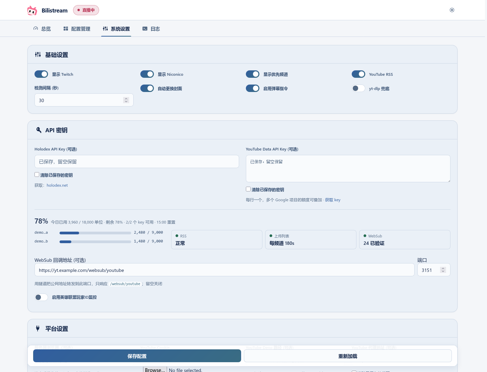

# Advanced settings

[Back to the main guide](../README.md) · [中文](advanced-settings.zh_CN.md)

The main guide covers ordinary YouTube/Twitch rebroadcasting. Enable these features as needed.

## Priority channel

**Priority channel:** an optional card for preferred YouTube/Twitch channels. Basic Settings → **显示优先频道** only shows/hides the card. Its monitor switch enables priority selection; **自动重启流** allows an active rebroadcast to switch when the priority channel becomes playable. Hiding the card does not stop its monitor.

1. In System Settings → Basic Settings, enable **显示优先频道** and save.
2. Choose the channel and default area on its dashboard card, then enable its monitor.
3. Enable **自动重启流** if it should interrupt another rebroadcast after priority playback is confirmed.

Visibility and monitoring are independent. Hiding the card preserves an enabled monitor; turn off the card's monitor switch to stop priority scheduling.

## YouTube discovery settings

| Setting/source | Purpose |
| --- | --- |
| YouTube Data API keys | Confirm live/upcoming status and fund uploads-playlist polling. Multiple keys from different Google projects can provide separate quotas. |
| **YouTube RSS** in Basic Settings | Read channel feeds; on by default. Turning it off leaves WebSub and budgeted uploads-playlist discovery running. |
| WebSub callback URL and port | Receive push hints. Works on a standalone server; requires a YouTube key and a reachable callback. Empty URL disables it. |
| Holodex API key | Supplement the list with metadata, categories, schedules and external streams. Optional Holodex login enables favourites. |
| **yt-dlp 兜底** in Basic Settings | Probe YouTube directly every monitor cycle. With it off, index mode still has a periodic yt-dlp safety probe. |

RSS/WebSub discover video IDs; neither proves that a stream is playable. The Data API classifies them, and playback still needs a usable stream URL. Failed/disabled RSS falls back to uploads polling within the available budget. WebSub failure restores normal polling speed. See [discovery and fallback details](youtube-discovery.md) and [WebSub tunnel setup](websub-tunnel.md).

In a cluster with a usable shared index, the **YouTube index node** handles discovery. Set its keys, RSS and callback there. The **active restream node** may be a different machine. These names describe separate responsibilities.

## Public status page

One computer or server is enough. In **System Settings → 公开状态页**, select **本机** and save; leave multi-server mode off. The default viewer URL is `http://127.0.0.1:23234`. [Single-server setup and sharing](public-status.md).

## Multi-server mode

**Optional multi-server mode:** active/standby control, health checks, configuration sync and automatic failover. The public status page runs on a selected node, with a separate listener.

- Off by default. Each node needs a unique ID, reachable admin API address and consistent membership. Nodes use a shared communication key; their Web UI passwords can differ.
- The active restream node publishes; standby nodes wait for handoff. Automatic failover relies on heartbeats, quorum agreement and source-shutdown checks, and remains fenced when safe takeover cannot be confirmed.
- Select the public-status node, separate listener port and public URL. The viewer listener does not expose admin routes.
- A public-status node with usable YouTube keys also acts as the YouTube index node; it may differ from the active restream node.
- Keys, RSS, WebSub callback and card visibility are node-local settings. In shared-index mode configure discovery on the index node.

See [discovery fallbacks](youtube-discovery.md) and [WebSub tunnel setup](websub-tunnel.md).

Create the communication key **once**, then copy the same file to each node over SSH:

```bash
umask 077
mkdir -p ~/.config/bilistream
openssl rand -hex 32 > ~/.config/bilistream/cluster-token
chmod 600 ~/.config/bilistream/cluster-token
./bilistream --bind 0.0.0.0 \
  --password-file ~/.config/bilistream/webui-password \
  --cluster-token-file ~/.config/bilistream/cluster-token
```

`BILISTREAM_CLUSTER_TOKEN_FILE` can also specify the file. Keep this key separate from the Web UI password; it is plaintext protected by file permissions. Use HTTPS or a private network for node API addresses. A missing or mismatched key prevents peer authentication.

When upgrading from shared Web UI password authentication, stop the cluster, configure this key and upgrade **all** nodes before resuming. Sign in to the Web UI again after the first upgrade. Later restarts preserve browser sessions; logout, expiry (30 days), or restarting with a changed password invalidates them. Backups exclude browser sessions. Rotate the communication key on all nodes together and restart them.

## Niconico Live

Configure the Niconico channel and install streamlink, then enter its `user_session` value in System Settings. A full cookie export is unnecessary; legacy Netscape paths remain supported. Daily checks report validity without renewing the session, and distinguish network uncertainty from invalid credentials. [Session checks](niconico-session.md).

Basic Settings has independent Twitch, Niconico and priority-card visibility switches. Hiding a card leaves monitoring unchanged. The multi-server panel is hidden while multi-server mode is off. Niconico uses piped ingest; priority channels currently support YouTube/Twitch.

## Settings preview



Rendered from the real UI using simulated data.
