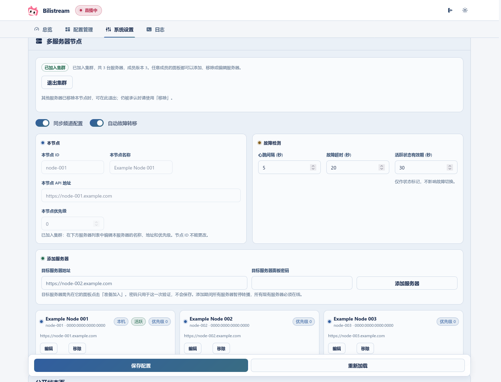

# Advanced settings

[Back to the main guide](../README.md) · [中文](advanced-settings.zh_CN.md)

The main guide covers ordinary YouTube/Twitch rebroadcasting. Enable these features as needed.

## Control panel

The YouTube and Twitch cards let you configure title, area, quality, crop and HLS cache by platform. Stream controls include Bilibili start/stop, rebroadcast restart, live bitrate/cache meters, title/area/cover updates and collision avoidance. A Holodex API key adds live and upcoming streams, target switching and suggested areas; optional Holodex login adds favourites.

The priority monitor and multi-server mode are off by default. Display preferences do not change monitor state. Existing configuration keys remain compatible.

## Command-line options

Launch the console Web UI or system tray, or change an individual setting:

```bash
./bilistream --webui
./bilistream --tray
./bilistream --port 3150
./bilistream --bind 127.0.0.1
./bilistream --ffmpeg-log-level error
```

The tray is the default on Windows; the console Web UI is the default on Linux/macOS. These commands use `./bilistream`; on Windows use `bilistream.exe` instead.

| Option | Environment variable | Purpose |
| --- | --- | --- |
| `--bind ADDR` | `BILISTREAM_BIND` | Admin listen address; default `127.0.0.1`. |
| `-p`, `--port PORT` | `BILISTREAM_PORT` | Admin port; default `3150`. |
| `--password PASSWORD`, `--password-file PATH` | `BILISTREAM_PASSWORD` | Initial password import only; saved or explicitly cleared state takes precedence. See [remote access and password](remote-access.md). |
| `--ffmpeg-log-level LEVEL` | `BILISTREAM_FFMPEG_LOG_LEVEL` | `error`, `info` or `debug`; default `error`. |
| `--reset-panel-password` | — | Clear the panel password offline with the service stopped, then exit; see [recovery](remote-access.md#forgotten-password). |
| `--export-legacy DIR` | — | Export plaintext for an older binary and exit; see [downgrade](data-and-upgrades.md#downgrade). |
| `-h`, `--help` / `-V`, `--version` | — | Print help or version and exit. |
| — | `BILISTREAM_DATA_DIR`, `BILISTREAM_KEY_FILE` | Data directory and protected key location; see [data and backups](data-and-upgrades.md). |

## Priority channel

**Priority channel:** an optional card for preferred YouTube/Twitch channels. Basic Settings → **显示优先频道** only shows/hides the card. Its monitor switch enables priority selection; **自动重启流** allows an active rebroadcast to switch when the priority channel becomes playable. Hiding the card does not stop its monitor.

1. In System Settings → Basic Settings, enable **显示优先频道** and save.
2. Choose the channel and default area on its dashboard card, then enable its monitor.
3. Enable **自动重启流** if it should interrupt another rebroadcast after priority playback is confirmed.

Visibility and monitoring are independent. Hiding the card preserves an enabled monitor; turn off the card's monitor switch to stop priority scheduling.

## YouTube discovery settings

| Setting/source | Purpose |
| --- | --- |
| YouTube Data API keys | Confirm live/upcoming status and fund uploads-playlist polling. Multiple keys from different Google projects can provide separate quotas. |
| **YouTube RSS** in Basic Settings | Read channel feeds; on by default. Turning it off leaves WebSub and budgeted uploads-playlist discovery running. |
| WebSub callback URL and port | Receive push hints. Works on a standalone server; requires a YouTube key and a reachable callback. Empty URL disables it. |
| Holodex API key | Supplement the list with metadata, categories, schedules and external streams. Optional Holodex login enables favourites. |
| **yt-dlp 兜底** in Basic Settings | Probe YouTube directly every monitor cycle. With it off, index mode still has a periodic yt-dlp safety probe. |

RSS/WebSub discover video IDs; neither proves that a stream is playable. The Data API classifies them, and playback still needs a usable stream URL. Failed/disabled RSS falls back to uploads polling within the available budget. WebSub failure restores normal polling speed. See [discovery and fallback details](youtube-discovery.md) and [WebSub tunnel setup](websub-tunnel.md).

In a cluster with a usable shared index, the **YouTube index node** handles discovery. Set its keys, RSS and callback there. The **active restream node** may be a different machine. These names describe separate responsibilities.

## Public status page

One computer or server is enough. In **System Settings → 公开状态页**, select **本机** and save; leave multi-server mode off. The default viewer URL is `http://127.0.0.1:23234`. [Single-server setup and sharing](public-status.md).

## Multi-server mode

**Optional multi-server mode:** active/standby control, health checks, configuration sync and automatic failover. The public status page runs on a selected server, with a separate listener.

- Off by default; a single server needs no cluster setting.
- The active restream server publishes; standby servers wait for handoff. Automatic failover relies on heartbeats, majority agreement and source-shutdown checks, and remains fenced when safe takeover cannot be confirmed.
- Select the public-status server, separate listener port and public URL. The viewer listener does not expose admin routes.
- A public-status server with usable YouTube keys also acts as the YouTube index server; it may differ from the active restream server.
- Keys, RSS, WebSub callback and card visibility are server-local settings. In shared-index mode configure discovery on the index server.

See [discovery fallbacks](youtube-discovery.md) and [WebSub tunnel setup](websub-tunnel.md).

### Before you start

- Set a panel password on every server in **System Settings → 安全**; headless servers can use initial bootstrap from the [remote-access guide](remote-access.md). Adding a server checks that server’s panel password, so cluster setup stays disabled until a password exists. Passwords can differ between servers.
- Each server needs an admin address the others can reach: HTTPS with a valid certificate (for example through a reverse proxy or tunnel service), or a literal loopback address such as `http://127.0.0.1:8443` for an authenticated tunnel you run yourself. Plain LAN/VPN HTTP, self-signed certificates and redirects are rejected.

### Create a cluster and add servers

1. On the first server, open **System Settings → 多服务器节点**, fill in **本节点** (ID, name, address, priority) and click **新建集群**. It becomes the only member.
2. On each server to be added, fill in its **本节点** fields and click **准备加入**. This stops its restreaming until it has been added. The server stays paused until the addition completes or is cancelled; the reservation does not expire on its own.
3. On any server already in the cluster, enter the new server’s address and panel password under **添加服务器**. The password is sent once to that server and never stored.

Every member’s panel has the same controls: add a server, remove one, edit a server’s name, address or priority, and change the public-status server (**更改运行位置**). There is no manager server. A server’s node ID and identity cannot change; remove it and add it again instead. Changes take effect immediately and do not touch unsaved settings on the page.



### Maintenance rules

- Each change pauses restreaming on every server until it completes. All servers that remain in the cluster must be online, and a majority of the previous members must confirm. For example, two online servers of three can remove an offline standby, but an isolated server of a two-server cluster cannot remove the other.
- Removing the active server first stops its restreaming and confirms it has stopped. Removing the public-status server asks for a replacement, or for the page to be turned off. A removed server loses access on every remaining server even if it is offline. When it is reachable, it turns all of its monitors off and does not resume restreaming on its own.
- A server that still shows **已加入集群** can press **退出集群** after the others have already removed it. The button asks for confirmation, then asks every other server in its member list whether this exact identity is still a member. It turns monitors off and leaves only when each of them returns a signed confirmation that the identity is gone. Channels, credentials and the panel password stay. If any server still accepts the identity, nothing changes; use **移除** instead. If any server does not answer, or the reply fails a clock, signature or revision check and is not that confirmation, nothing changes and the panel names that server. A network partition is not removal. The button stays unavailable while a membership change is in progress. Afterwards, use **准备加入** here and **添加服务器** on a remaining server. The same node ID may be used; joining creates a new identity.
- The panel shows the current step and the servers that still need to answer. If the page reloads or a reply is lost, it continues the same change; use **重试** instead of starting a new one. A new change can start only after the previous one has reached every server.
- The server where a change started coordinates it. If that server goes offline, the change stays pending and the other servers stay paused until it returns. Do not remove it or rebuild the cluster to get past the pending change.

## Niconico Live

Configure the Niconico channel and install streamlink, then enter its `user_session` value in System Settings. A full cookie export is unnecessary; legacy Netscape paths remain supported. Daily checks report validity without renewing the session, and distinguish network uncertainty from invalid credentials. [Session checks](niconico-session.md).

Basic Settings has independent Twitch, Niconico and priority-card visibility switches. Hiding a card leaves monitoring unchanged. The multi-server dashboard card is hidden until this server is in a cluster. Niconico uses piped ingest; priority channels currently support YouTube/Twitch.

## Danmaku, area rules and LoL checks

Danmaku target changes use channel names saved in channel management, for example:

```text
%转播%YT%示例频道1%英雄联盟
%转播%TW%示例频道1%无畏契约
%查询
```

Area keyword rules may adjust the requested area. LoL player-name checking requires a Riot key; `lol_monitor_interval` is in minutes. Player-name filter keywords appear below the Riot API Key when LoL player ID monitoring is enabled.

## Settings preview


Rendered from the real UI using simulated data.
