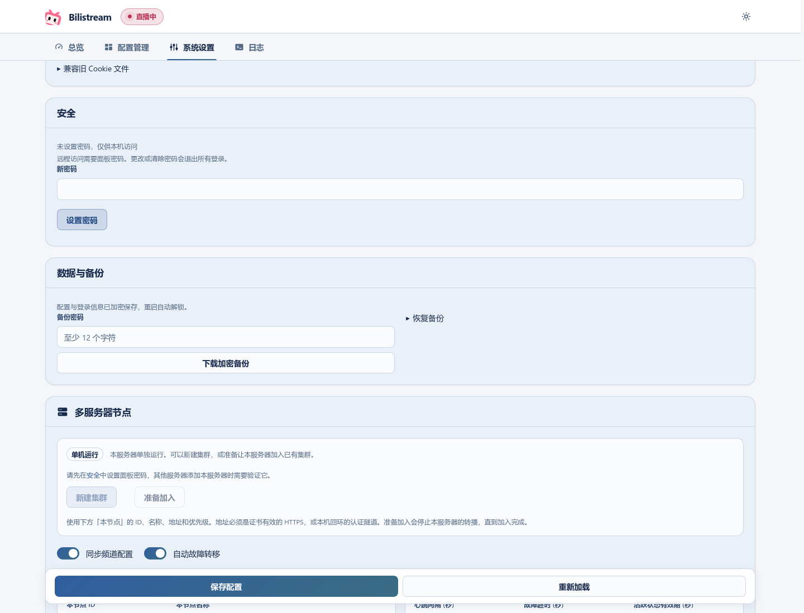

# Data, backups and upgrades

[Back to the quick start](../README.md) · [中文](data-and-upgrades.zh_CN.md)

## Where data lives

Settings, channels, rules and discovery statistics live in `data/bilistream.db` beside the executable. Configuration and login credentials are encrypted; the application unlocks them automatically on this computer. Change settings through the Web UI. `BILISTREAM_DATA_DIR` selects another data directory; `BILISTREAM_KEY_FILE` can select a protected key file **outside** it.

Keep the original key: copying the database alone is not a portable backup. Do not delete database `-wal` or `-shm` files. Images remain in cache directories, and `webui/` contains page assets.

## Back up and restore

Use **System Settings → 数据与备份** to download a password-protected backup. Keep its password separately. A new installation can restore it through **已有备份？直接恢复** in the setup wizard. Backups exclude the panel password and browser login sessions. Restore preserves the destination installation’s password choice; a fresh installation needs local password setup or initial password bootstrap.

Backups never contain cluster identities. A backup from a cluster member restores as a server outside any cluster, with monitoring off; create or join a cluster again afterwards. A server that is in a cluster or preparing to join one cannot restore a backup.



## Upgrade

Stop the old process before starting the new binary. Upgrade imports existing JSON/Cookie files automatically, including older configurations missing newer settings; those settings use their defaults. Original app-owned files are retired only after a verified encrypted recovery copy. External Cookie files are left untouched.

In a cluster, each server keeps its own database and key. Old and new cluster versions cannot run together: before upgrading, stop every server and take a physical backup of each one (stopped data directory, key file, executable and launch command). Then upgrade all servers and recreate the cluster as described in [upgrading from the shared-token cluster](advanced-settings.md#upgrading-from-the-shared-token-cluster).

## Downgrade

Stop the service and run this command with the **new** binary:

```bash
./bilistream --export-legacy ./downgrade-data
```

The new directory contains plaintext settings and credentials. Use it with the old binary and remove it when no longer needed.

Older binaries cannot read the panel password saved by the Web UI. Stop the service before rolling back. When starting an older binary on a remote address, explicitly supply `--password-file` or `BILISTREAM_PASSWORD`, or start locally first. Reverting the binary alone does not preserve the newer password protection. Legacy exports also exclude the panel password. Keep the original database and key so you can return to the newer version.

Once a server has created, prepared to join or joined a cluster, or holds a paused old cluster configuration, older versions refuse to open its database. A legacy export from such a server contains a configuration outside any cluster, with monitoring off. To roll back a cluster, stop every server and restore each one’s physical backup taken before the upgrade, all together. Never run old and new versions in one cluster, or replace the executable on only some servers.
