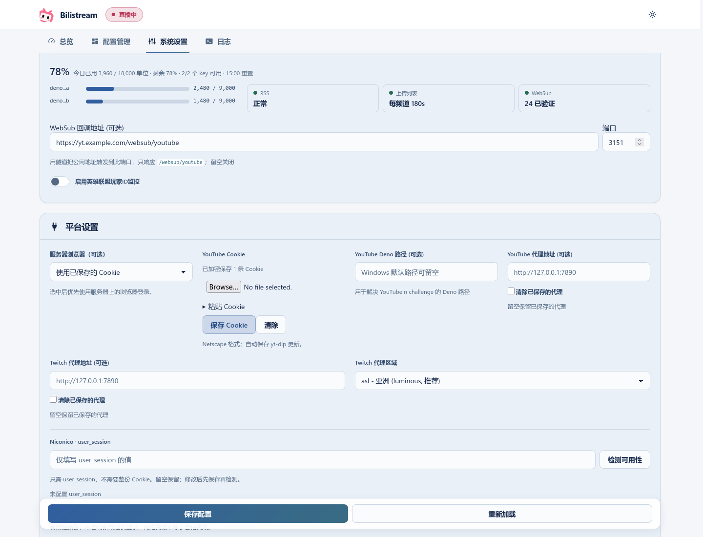

# First setup / 首次配置

[Quick start](../README.md) · [中文入门](../README.zh_CN.md) · [Install dependencies](dependencies.md) · [安装依赖](dependencies.zh_CN.md)

New installations start with an empty channel list and the 其他单机 area. Existing channels, areas and custom rules are kept.

新安装从空频道表开始，默认分区为「其他单机」。已有频道、分区和自定义规则会保留。

## Login / 登录

Scan the Bilibili QR code with the Bilibili app, then enter your room number in the next step.

使用 Bilibili App 扫码登录，下一步填写直播间号。

## Add channels / 添加频道

In step 3, choose an existing channel or **手动添加频道**. A display name is optional; you can change it later in configuration management.

- **YouTube:** paste a channel homepage, `@handle` or `UC…` channel ID. Click **识别频道** to resolve a homepage or handle.
- **Twitch:** enter the account login name shown in its URL.
- **Niconico:** enter its channel ID or `ch.nicovideo.jp` channel URL. Login settings are described in [Niconico session setup](niconico-session.md).

第 3 步可选择已有频道，也可手动添加。YouTube 支持主页地址或 @handle；Twitch 填写用户名；Niconico 填写频道 ID 或频道主页。频道名称可稍后修改。

### Holodex favourites / Holodex 收藏

Open **从 Holodex 收藏导入**, enter your API key and JWT, then click **登录并加载收藏**. Search and select the channels you want to add. They become choices for the YouTube target. **完成设置** saves your selections and login information; loading the list alone does not save them.

展开「从 Holodex 收藏导入」，填写 API Key 和 JWT，加载后勾选需要的频道。点击「完成设置」才会保存。加载失败或收藏为空时，可重试，也可跳过并手动添加。

## Choose what to monitor / 选择是否转播

Choose a target for each platform you want to monitor. **不转播** turns that platform's monitor off and keeps previous channel and quality preferences. Importing favourites does not start monitoring; you can leave all platforms off and enable them later.

为需要的平台选择转播目标，其余保持「不转播」。这会关闭监控，但保留已有频道与画质设置。也可以只导入收藏，稍后再开启转播。「显示卡片」只改变界面，不改变监控状态。

## Choose areas / 选择分区

Click **加载官方分区** to choose a Bilibili area by category. The same picker is available in area management, where it fills in the ID and name for you. Existing keywords and aliases are kept.

点击「加载官方分区」后按分类选择。配置管理中的分区选择器也会自动填写 ID 和名称，已有关键词与别名会保留。

If loading fails, use an existing local area or enter one manually in area management. A save commits settings, channels and areas together; if it fails, retry after resolving the reported issue.

加载失败时仍可选择本地分区，或在分区管理中手动填写。设置、频道与分区会一起保存；失败时修复提示的问题后重试。

## Panel password / 面板密码

At the end of step 3, **设置面板密码** is optional for localhost use. Enable it and enter a password before allowing remote access. If a password was already set at startup, the wizard keeps it and shows it as configured. **完成设置** saves the new password together with the settings and keeps you signed in.

第 3 步最后的「设置面板密码」默认关闭，本机使用可跳过，远程访问前请先设置。启动时已有密码会显示为已配置并保留；点击「完成设置」时，新密码与设置一起保存，并保持登录。

If the save response is lost, the page checks login and setup status before letting you submit again; sign in if prompted. After setup, **System Settings → 安全** lets you set, change or clear the password without affecting other unsaved settings. Change and clear require the current password; remote listeners cannot clear it. See [remote access and recovery](remote-access.md).

保存响应丢失时，页面先检查登录与配置状态，必要时请登录，再确认是否重试。完成后可在「系统设置 → 安全」设置、更改或清除密码，不影响其他未保存设置；更改和清除均需当前密码，远程监听不能清除。详见[远程访问与密码恢复](remote-access.zh_CN.md)。

## Cookies / Cookie

In platform settings, upload or paste a Netscape `cookies.txt` for YouTube. It is stored encrypted, and yt-dlp updates are saved automatically. The optional browser source reads a browser on the server, not on the computer viewing the page.

在平台设置上传或粘贴 YouTube Cookie，保存后无需保留常驻明文文件。浏览器来源读取的是服务器上的浏览器。

## Next steps / 后续设置

- [Back up, restore or upgrade](data-and-upgrades.md) · [备份、恢复与升级](data-and-upgrades.zh_CN.md)
- [Remote access and password](remote-access.md) · [远程访问与密码](remote-access.zh_CN.md)
- [Advanced settings, danmaku and LoL checks](advanced-settings.md) · [高级设置、弹幕与英雄联盟检查](advanced-settings.zh_CN.md)
