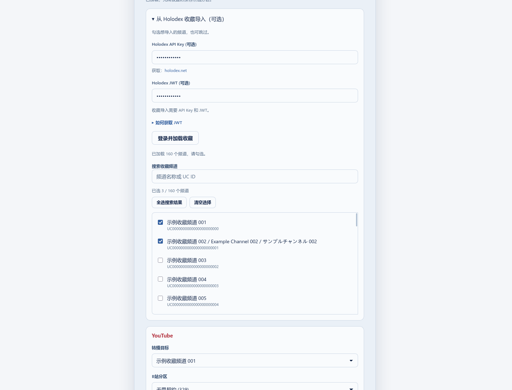
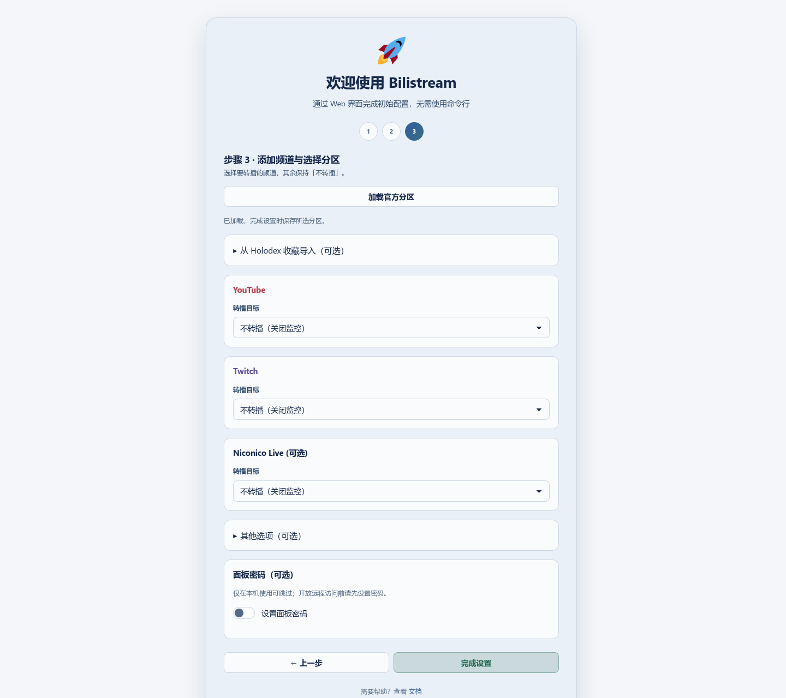
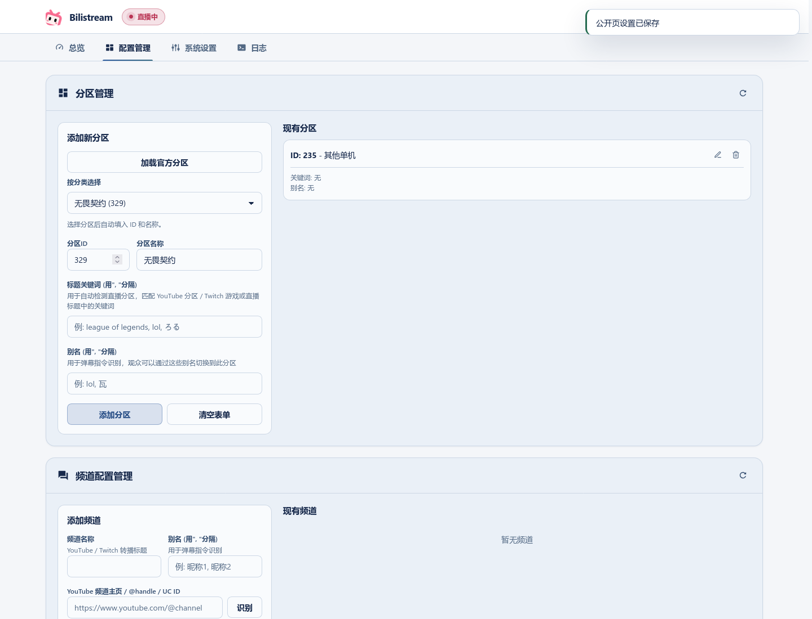

# First setup / 首次配置

New installations start with an empty channel list and the 其他单机 area. Existing channels, areas and custom rules are kept.

新安装从空频道表开始，默认分区为「其他单机」。已有频道、分区和自定义规则会保留。

## Login / 登录

Scan the Bilibili QR code with the Bilibili app, then enter your room number in the next step.

使用 Bilibili App 扫码登录，下一步填写直播间号。

## Add channels / 添加频道

In step 3, choose an existing channel or **手动添加频道**. A display name is optional; you can change it later in configuration management.

- **YouTube:** paste a channel homepage, `@handle` or `UC…` channel ID. Click **识别频道** to resolve a homepage or handle.
- **Twitch:** enter the account login name shown in its URL.
- **Niconico:** enter its channel ID or `ch.nicovideo.jp` channel URL. Login settings are described in [Niconico session setup](niconico-session.md).

第 3 步可选择已有频道，也可手动添加。YouTube 支持主页地址或 @handle；Twitch 填写用户名；Niconico 填写频道 ID 或频道主页。频道名称可稍后修改。

### Holodex favourites / Holodex 收藏

Open **从 Holodex 收藏导入**, enter your API key and JWT, then click **登录并加载收藏**. Search and select the channels you want to add. They become choices for the YouTube target. **完成设置** saves your selections and login information; loading the list alone does not save them.

展开「从 Holodex 收藏导入」，填写 API Key 和 JWT，加载后勾选需要的频道。点击「完成设置」才会保存。加载失败或收藏为空时，可重试，也可跳过并手动添加。

## Choose what to monitor / 选择是否转播

Choose a target for each platform you want to monitor. **不转播** turns that platform's monitor off and keeps previous channel and quality preferences. Importing favourites does not start monitoring; you can leave all platforms off and enable them later.

为需要的平台选择转播目标，其余保持「不转播」。这会关闭监控，但保留已有频道与画质设置。也可以只导入收藏，稍后再开启转播。「显示卡片」只改变界面，不改变监控状态。

## Choose areas / 选择分区

Click **加载官方分区** to choose a Bilibili area by category. The same picker is available in area management, where it fills in the ID and name for you. Existing keywords and aliases are kept.

点击「加载官方分区」后按分类选择。配置管理中的分区选择器也会自动填写 ID 和名称，已有关键词与别名会保留。

If loading fails, use an existing local area or enter one manually in area management. If saving fails, you can retry; entries already saved are kept.

加载失败时仍可选择本地分区，或在分区管理中手动填写。保存失败可重试，已保存的条目会保留。
