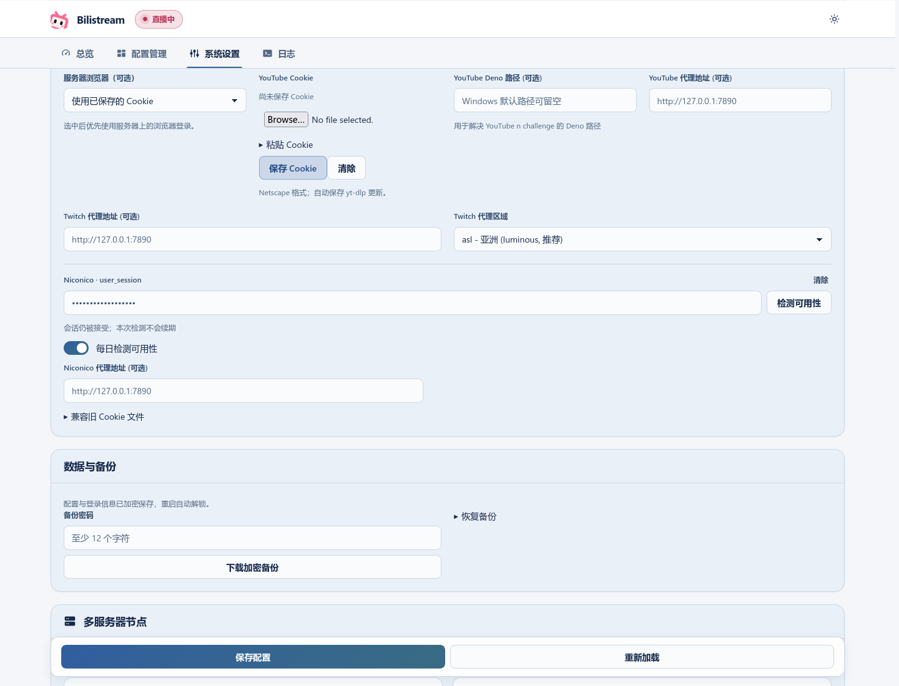

# Niconico user_session

在系统设置 → 平台设置中填写 `user_session` Cookie 的值，点击「保存并检测」即可验证；已有登录信息可直接「检测可用性」。已保存的内容按字符数显示圆点；输入新值后保存即可替换。点击「清除」立即移除已保存的登录信息，无需再保存配置。

Enter only the `user_session` value; a full cookie export is unnecessary. Previously configured Netscape cookies are imported into encrypted storage. A directly entered value takes precedence.

## Validity checks / 有效性预警

Daily checking is on by default after you configure a session, even when monitoring is off or the card is hidden.

- **Accepted / 会话仍被接受:** your login is currently accepted; the next check is in 24 hours.
- **Invalid / 登录会话已失效:** log in to Niconico again and update the saved value.
- **Unavailable / 暂时无法验证:** a network or service problem prevented verification. This does not mean the session expired; the next attempt is in one hour.
- **Unconfigured / 未配置:** enter a session value to use login checks.

Changing the credential triggers a new check; restarting the application checks again. The manual button checks the saved credential immediately. Turning daily checks off does not affect streamlink authentication.

**Checks do not refresh or extend `user_session`.** They provide early warning for infrequent rebroadcasts; successful validation does not guarantee the next stream is accessible or that the session cannot expire later. Login elsewhere or logout can invalidate it independently.

In multi-server mode, configure the session separately on each computer that restreams Niconico. Login data stays encrypted on that node and is not included in cluster synchronization.
