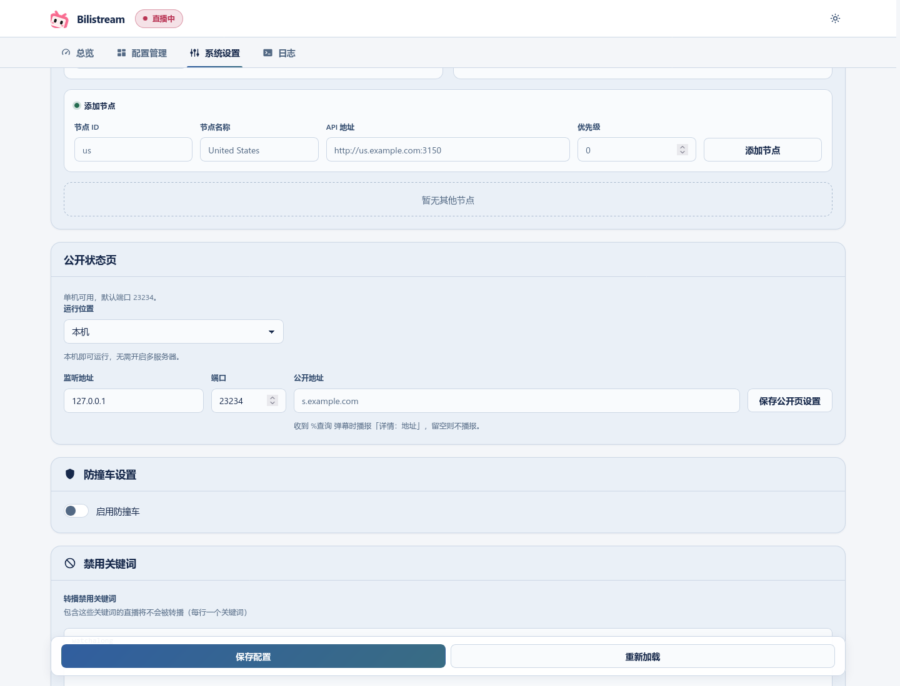

# Public status page / 公开状态页

A single computer or server can provide the viewer page while running Bilistream. Multi-server mode is optional.

## Single computer or server / 单机

1. Open **系统设置 → 公开状态页**. Keep multi-server mode off.
2. Set **运行位置** to **本机**, then save. The default address is `http://127.0.0.1:23234`.
3. To share it with viewers, route a tunnel or reverse proxy to that viewer port, or use a reachable listening address. Enter your public address if `%查询` should announce it.

单台电脑或服务器即可运行：在**系统设置 → 公开状态页**选择**本机**并保存，无需添加其他节点。本机可访问 `http://127.0.0.1:23234`；给他人访问时，将隧道或反向代理指向这个公开页端口。程序和电脑需要保持运行。

Choose **不启用** and save to stop the viewer listener. Changes take effect within about 15 seconds. The public address field controls the address announced by `%查询`; it does not create a domain or tunnel.

选择**不启用**并保存即可关闭，约 15 秒内生效。「公开地址」用于 `%查询` 播报，不会自动建立域名或隧道。

The viewer page is read-only and uses a separate port from the admin panel. It displays the local restream status in single-server mode. Its live/upcoming channel list uses your channel roster and configured discovery sources.

## Multiple servers / 多服务器

With multi-server mode enabled, select the node that should serve the page. Public settings synchronize to the other nodes; viewers see the active restream node's status. The serving node also supplies the shared YouTube index when it has usable YouTube keys. See [advanced settings](advanced-settings.md) / [高级设置](advanced-settings.zh_CN.md).
